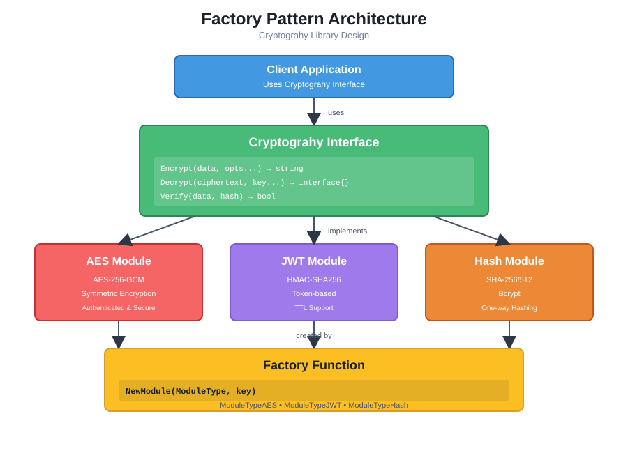

# Cryptography

A flexible, modular cryptography library for Go that supports multiple encryption algorithms with a unified interface. Easily switch between different encryption modules (AES, JWT, etc.) without changing your code.

## Features

- 🔄 **Modular Design**: Easy to switch between encryption modules
- 🔑 **Flexible Keys**: Support for key rotation and per-operation keys
- 📦 **Flexible Data Types**: Encrypt strings, maps, structs, or any data type
- ⏱️ **TTL Support**: Optional time-to-live for encrypted data (JWT)
- 🎯 **Unified Interface**: Same API for all encryption modules
- 🔒 **Production Ready**: Uses industry-standard algorithms (AES-256-GCM, HMAC-SHA256)
- 🔐 **One-Way Hashing**: SHA-256, SHA-512, and bcrypt for password hashing and data integrity

## Design Pattern

This library implements the **Factory Pattern** with a unified interface, allowing easy switching between different encryption modules without changing client code.




### Pattern Benefits

- **Polymorphism**: All modules implement the same interface
- **Flexibility**: Easy to add new encryption algorithms
- **Maintainability**: Changes to one module don't affect others
- **Testability**: Easy to mock and test individual modules
- **Type Safety**: Interface ensures consistent API across modules

## Installation

```bash
go get github.com/tjandrayana/cryptography
```

## Quick Start

```go
package main

import (
    "fmt"
    "github.com/tjandrayana/cryptography"
)

func main() {
    // Create an AES encryption module
    module, err := cryptography.NewModule(cryptography.ModuleTypeAES, "my-secret-key-32-bytes-long!!")
    if err != nil {
        // Handle error appropriately (log, return, etc.)
        // Never panic in production code
    }

    // Encrypt data
    encrypted, err := module.Encrypt("Hello, World!")
    if err != nil {
        // Handle error appropriately (log, return, etc.)
        // Never panic in production code
    }
    fmt.Println("Encrypted:", encrypted)

    // Decrypt data
    decrypted, err := module.Decrypt(encrypted)
    if err != nil {
        // Handle error appropriately (log, return, etc.)
        // Never panic in production code
    }
    fmt.Println("Decrypted:", decrypted)
}
```

## Usage Examples

### Basic Encryption/Decryption

```go
// Create a module
module, _ := cryptography.NewModule(cryptography.ModuleTypeAES, "my-secret-key-32-bytes-long!!")

// Encrypt a string
encrypted, _ := module.Encrypt("Hello, World!")

// Decrypt
decrypted, _ := module.Decrypt(encrypted)
fmt.Println(decrypted) // Output: Hello, World!
```

### Encrypting Structured Data

The library supports any data type - strings, maps, structs, etc.

```go
// Encrypt a map
data := map[string]interface{}{
    "user_id": 12345,
    "username": "john_doe",
    "email": "john@example.com",
}

encrypted, _ := module.Encrypt(data)
decrypted, _ := module.Decrypt(encrypted)

// Decrypted data maintains its structure
if dataMap, ok := decrypted.(map[string]interface{}); ok {
    fmt.Println("User ID:", dataMap["user_id"])
}
```

### Encrypting Structs

```go
type User struct {
    ID       int    `json:"id"`
    Username string `json:"username"`
    Email    string `json:"email"`
}

user := User{ID: 123, Username: "jane_doe", Email: "jane@example.com"}

encrypted, _ := module.Encrypt(user)
decrypted, _ := module.Decrypt(encrypted)
```

### JWT with TTL (Time To Live)

```go
import (
    "time"
    "github.com/tjandrayana/cryptography"
)

// Create JWT module
jwtModule, _ := cryptography.NewModule(cryptography.ModuleTypeJWT, "my-jwt-secret-key")

// Encrypt with 1 hour expiration
data := map[string]interface{}{
    "user_id": 12345,
    "username": "john_doe",
}

token, _ := jwtModule.Encrypt(data, cryptography.WithTTL(1*time.Hour))

// Decrypt (will fail if token expired)
decrypted, err := jwtModule.Decrypt(token)
if err != nil {
    // Handle expiration error
    fmt.Println("Token expired:", err)
}
```

### Using Different Keys for Decryption

Support for key rotation and flexible key management:

```go
// Encrypt with default key
encrypted, _ := module.Encrypt("Secret message")

// Decrypt with default key
decrypted1, _ := module.Decrypt(encrypted)

// Decrypt with a different key (for key rotation scenarios)
differentKey := "different-secret-key-32-bytes-long!!"
decrypted2, _ := module.Decrypt(encrypted, differentKey)
```

### One-Way Hashing

Hash data for integrity checks or password storage using the same `Encrypt()` interface:

```go
// Create a hash module (SHA-256 by default)
hashModule, _ := cryptography.NewHashModule("sha256")

// Hash data using Encrypt() - same interface as encryption!
data := "Sensitive information"
hash, _ := hashModule.Encrypt(data)

// Verify data matches hash
isValid, _ := hashModule.Verify(data, hash)
if isValid {
    fmt.Println("Data integrity verified!")
}

// For passwords, use bcrypt
bcryptModule, _ := cryptography.NewHashModule("bcrypt")
passwordHash, _ := bcryptModule.Encrypt("myPassword123")
isValid, _ := bcryptModule.Verify("myPassword123", passwordHash)
```

### Switching Between Modules

The unified interface makes it easy to switch encryption algorithms:

```go
// Use AES
aesModule, _ := cryptography.NewModule(cryptography.ModuleTypeAES, "aes-key-32-bytes-long!!")

// Switch to JWT - same interface!
jwtModule, _ := cryptography.NewModule(cryptography.ModuleTypeJWT, "jwt-secret-key")

// Switch to Hash - same interface!
hashModule, _ := cryptography.NewHashModule("sha256")

// All modules implement the same interface
var modules []cryptography.Cryptography = []cryptography.Cryptography{
    aesModule, 
    jwtModule,
    hashModule,
}

for _, module := range modules {
    result, _ := module.Encrypt("Hello")
    
    // For hash modules, use Verify instead of Decrypt
    isValid, err := module.Verify("Hello", result)
    if err == nil {
        // It's a hash module
        fmt.Println("Hash verified:", isValid)
    } else {
        // It's an encryption module
        decrypted, _ := module.Decrypt(result)
        fmt.Println(decrypted)
    }
}
```

## API Reference

### Interface

```go
type Cryptography interface {
    // Encrypt encrypts or hashes data of any type
    // Returns the encrypted/hashed string representation
    // For hash modules, this performs one-way hashing
    Encrypt(data interface{}, opts ...interface{}) (string, error)
    
    // Decrypt decrypts the ciphertext and returns the original data
    // Key is optional - if not provided, uses module's default key
    // For hash modules, this returns an error (hashing is one-way)
    Decrypt(ciphertext string, key ...string) (interface{}, error)
    
    // Verify checks if the data matches the hash/encrypted value
    // Returns true if the data matches, false otherwise
    // For encryption modules, this decrypts and compares
    // For hash modules, this verifies the hash directly
    Verify(data interface{}, hash string) (bool, error)
}
```

### Factory Functions

```go
// Create encryption module
func NewModule(moduleType ModuleType, key string) (Cryptography, error)

// Create hash module with specific algorithm
func NewHashModule(algorithm string) (Cryptography, error)
// algorithm: "sha256" (default), "sha512", or "bcrypt"

// Create bcrypt module with custom cost
func NewBcryptModule(cost int) (Cryptography, error)
// cost: bcrypt cost factor (4-31, default is 10)
```

**Module Types:**
- `cryptography.ModuleTypeAES` - AES-256-GCM encryption
- `cryptography.ModuleTypeJWT` - JWT token encryption
- `cryptography.ModuleTypeHash` - One-way hashing (SHA-256, SHA-512, bcrypt)

### Options

```go
// EncryptOptions for encryption configuration
type EncryptOptions struct {
    TTL time.Duration // Time to live (0 means no expiration)
}

// Helper function to create options with TTL
func WithTTL(ttl time.Duration) *EncryptOptions
```

## Module Details

### AES Module

- **Algorithm**: AES-256-GCM
- **Key Size**: 32 bytes (automatically padded/truncated)
- **Features**:
  - Symmetric encryption
  - Authenticated encryption (GCM mode)
  - Supports any data type
- **TTL**: Not applicable (symmetric encryption)

**Example:**
```go
aesModule, _ := cryptography.NewModule(cryptography.ModuleTypeAES, "my-secret-key-32-bytes-long!!")
encrypted, _ := aesModule.Encrypt("Hello, World!")
decrypted, _ := aesModule.Decrypt(encrypted)
```

### JWT Module

- **Algorithm**: HMAC-SHA256
- **Format**: JWT (JSON Web Token)
- **Features**:
  - Token-based encryption
  - Optional TTL/expiration
  - Structured data support
  - Signature verification
- **TTL**: Supported via `EncryptOptions`

**Example:**
```go
jwtModule, _ := cryptography.NewModule(cryptography.ModuleTypeJWT, "my-jwt-secret-key")

// Without TTL
token, _ := jwtModule.Encrypt(map[string]interface{}{"user_id": 123})

// With TTL (1 hour)
token, _ := jwtModule.Encrypt(
    map[string]interface{}{"user_id": 123},
    cryptography.WithTTL(1*time.Hour),
)

// Decrypt
data, _ := jwtModule.Decrypt(token)
```

### Hash Module

- **Algorithms**: SHA-256, SHA-512, bcrypt
- **Features**:
  - One-way hashing (cannot be decrypted)
  - Data integrity verification
  - Password hashing (bcrypt)
  - Supports any data type
- **Use Cases**: Password storage, data integrity checks, checksums

**Example - SHA-256:**
```go
// Create SHA-256 hash module
hashModule, _ := cryptography.NewHashModule("sha256")

// Hash data using Encrypt() - same interface!
hash, _ := hashModule.Encrypt("Hello, World!")
fmt.Println("Hash:", hash)

// Verify data matches hash
isValid, _ := hashModule.Verify("Hello, World!", hash)
fmt.Println("Valid:", isValid) // true
```

**Example - SHA-512:**
```go
// Create SHA-512 hash module
hashModule, _ := cryptography.NewHashModule("sha512")

hash, _ := hashModule.Encrypt("Hello, World!")
isValid, _ := hashModule.Verify("Hello, World!", hash)
```

**Example - Bcrypt (for passwords):**
```go
// Create bcrypt hash module with default cost
bcryptModule, _ := cryptography.NewHashModule("bcrypt")

// Or with custom cost (higher = more secure but slower)
bcryptModule, _ := cryptography.NewBcryptModule(12)

// Hash a password using Encrypt()
password := "mySecurePassword123"
hashedPassword, _ := bcryptModule.Encrypt(password)

// Verify password
isValid, _ := bcryptModule.Verify(password, hashedPassword)
if isValid {
    fmt.Println("Password is correct!")
}
```

**Note:** For hash modules, `Encrypt()` performs one-way hashing, and `Decrypt()` will return an error since hashing is one-way. The same `Encrypt()` interface is used for both encryption and hashing!

## Advanced Features

### Flexible Data Types

The library automatically handles different data types:

- **Strings**: Direct encryption
- **Maps**: Converted to JSON then encrypted
- **Structs**: Marshaled to JSON then encrypted
- **Any type**: Automatically marshaled/unmarshaled

### Key Management

- **Default Key**: Set during module creation
- **Per-Operation Key**: Override key during decrypt
- **Key Rotation**: Decrypt old data with new keys

### Error Handling

```go
encrypted, err := module.Encrypt(data)
if err != nil {
    // Handle encryption error
}

decrypted, err := module.Decrypt(encrypted)
if err != nil {
    // Handle decryption error
    // Common errors:
    // - Invalid ciphertext format
    // - Invalid signature (JWT)
    // - Token expired (JWT)
    // - Decryption failed
}
```

## Best Practices

1. **Key Management**: Store keys securely (environment variables, secret managers)
2. **Key Size**: Use appropriate key sizes (32 bytes for AES-256)
3. **TTL Usage**: Set appropriate TTL for JWT tokens based on use case
4. **Error Handling**: Always check errors from Encrypt/Decrypt operations
5. **Type Assertions**: When decrypting, use type assertions to handle different return types

## Contributing

Contributions are welcome! Please feel free to submit a Pull Request.

## License

This project is licensed under the MIT License - see the [LICENSE](LICENSE) file for details.

## Author

**TJ (tjandrayana)**

- GitHub: [@tjandrayana](https://github.com/tjandrayana)

